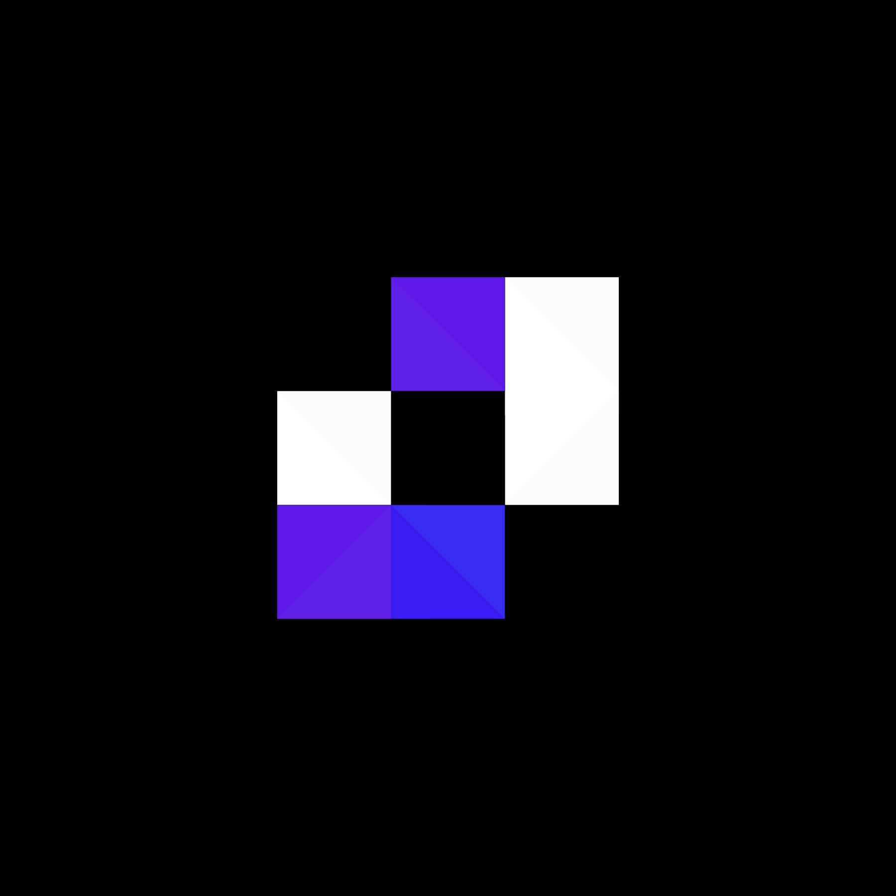
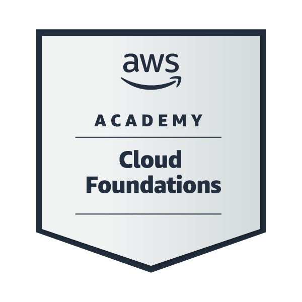

# 💫 Sobre mim:

 
  Sou um desenvolvedor full-stack com foco em data science e cloud computing. Tenho experiência como instrutor de programação e robótica. Trabalhando atualmente em projetos próprios.

  🧠 Formado no Instituto Federal de Educação, Ciência e Tecnologia Catarinense - Informática para Internet.

  🥇 Vencedor do primeiro Hackathon Agro do IFC Concórdia!

  🥇 Vencedor da primeira feira de energia limpa do Consórcio Itá!

  📨 Você pode entrar em contato comigo por esses meios:

  
  

## 👨‍💻Principais linguagens:

 
 

## 🔌Minhas escolhas para banco de dados:

## 💻 Outras habilidades:

 
 
 

## 🧩 Frameworks favoritos:

## ✏️ Aprendendo

 

