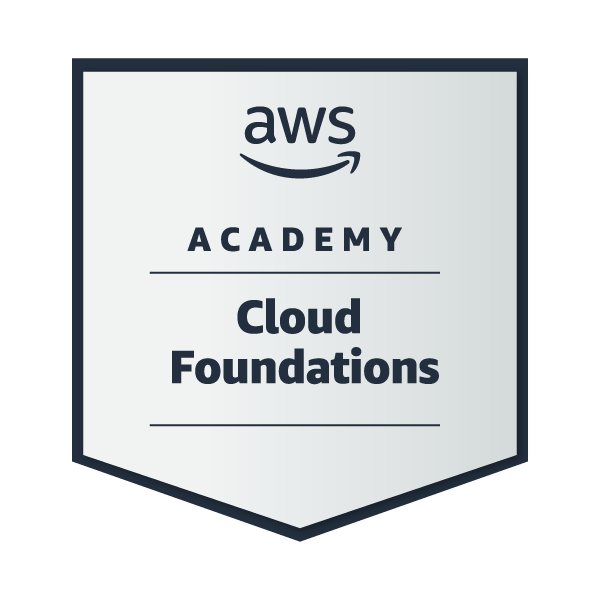

  <h1>Vitor Mignoni</h1>
  
<strong>Desenvolvedor Full-Stack | Arquitetura Backend, Cloud & Data</strong>

  

    <picture>
      <!-- Se o usuário estiver usando Dark Mode -->
      <source media="(prefers-color-scheme: dark)" srcset="./assets/neat-logo-dark.png">
      <!-- Se o usuário estiver usando Light Mode -->
      <source media="(prefers-color-scheme: light)" srcset="./assets/neat-logo-light.png">
      
    </picture>
  

  

    &nbsp;<!--
    -->
  

---

### 👨‍💻 Sobre mim

Desenvolvedor focado em desenvolvimento backend escalável, modelagem de dados e soluções em nuvem. Possuo experiência prévia como instrutor de programação e robótica, atuando hoje no desenvolvimento e arquitetura de projetos próprios.

  <!-- Selo AWS flutuando à direita sem bordas de tabela -->
  

  <ul>
    <li>💼 <strong>Trabalho:</strong> Programador Angular — Arpa Sistemas.</li>
    <li>🎓 <strong>Formação:</strong> Informática para Internet — IFC Campus Concórdia.</li>
    <li>🥇 <strong>Hackathon Agro:</strong> 1º Lugar no Hackathon Agro do IFC Concórdia.</li>
    <li>🥇 <strong>Energia Limpa:</strong> 1º Lugar na Feira Regional de Energia Limpa (Consórcio Itá).</li>
    <li>☁️ <strong>Certificação & Treinamento:</strong> Conhecimentos práticos de arquitetura e infraestrutura AWS.</li>
  </ul>

 

---

### 🛠️ Stacks & Métricas de Linguagens

  <!-- Card de Linguagens flutuando à direita -->
  

  

    <h4>Linguagens & Backend</h4>
    
    
    
    
    
    <h4>Frontend & Interfaces</h4>
    
    
    
    
    
    <h4>Bancos de Dados & Cloud</h4>
    
    
    
    
    
  

 

---

### 📊 Atividade no GitHub

  

